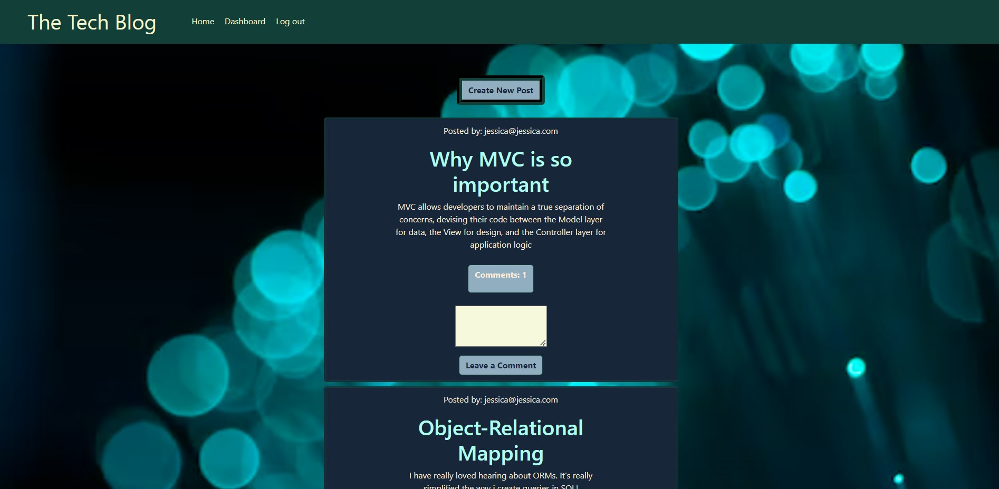
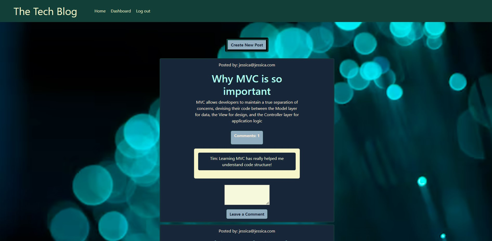

# The Tech Blog

## Description

This repo contains a CMS-style blog site where developers can publish their blog posts and comment on other developers’ posts as well.

## Deployed Link

https://kyle188techblog.herokuapp.com/

## Usage

## Technologies Used

* JavaScript
* HTML
* Handlebars
* Express
* Sequelize

## Installation  

1. Clone repository or download
2. Open root in integrated terminal
3. enter mysql -u root -p
4. enter password
5. enter "quit"
6. npm run seeds
7. npm run start
8. See seeds folder for userdata to log in

## License

MIT